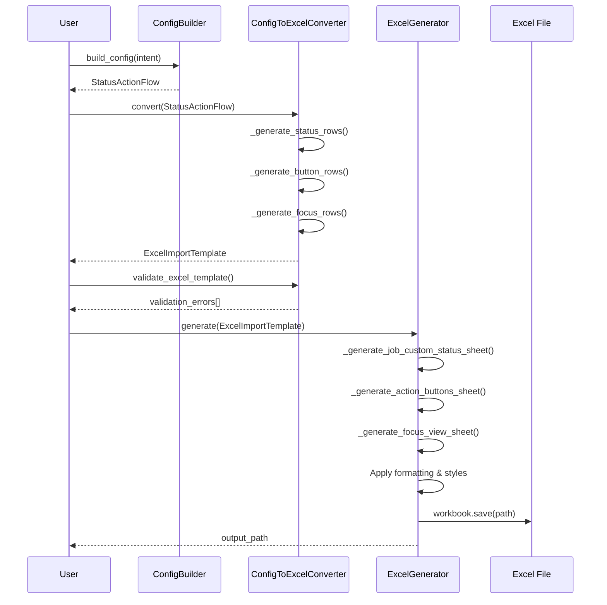

I have created the following plan after thorough exploration and analysis of the codebase. Follow the below plan verbatim. Trust the files and references. Do not re-verify what's written in the plan. Explore only when absolutely necessary. First implement all the proposed file changes and then I'll review all the changes together at the end.

## Observations

The project has a well-structured foundation with Pydantic models, config builder, and a converter that transforms `StatusActionFlow` configurations into `ExcelImportTemplate` schemas. The `config_to_excel.py` service successfully converts domain models to the intermediate Excel schema format, and `prod_data_parser.py` demonstrates the expected Excel structure by parsing production files. However, the actual Excel file generation using `openpyxl` to create physical `.xlsx` files is not yet implemented. The system currently stops at the schema level without producing the importable Excel workbook that FieldPulse requires.

## Approach

Create an `ExcelGenerator` class that takes `ExcelImportTemplate` objects and generates properly formatted `.xlsx` files using `openpyxl`. The generator will create 3 tabs matching FieldPulse's import template structure with appropriate headers, cell formatting, and data types. This completes the pipeline: `StatusActionFlow` → `ConfigToExcelConverter` → `ExcelImportTemplate` → `ExcelGenerator` → `.xlsx` file. The implementation will reference production Excel files to ensure formatting compatibility and include validation to catch common errors before file generation.

## Implementation Steps

### 1. Create ExcelGenerator Service Class

Create `file:src/clearpath_agent/services/excel_generator.py` with the main `ExcelGenerator` class:

- Initialize with optional formatting preferences (header styles, default column widths)
- Accept `ExcelImportTemplate` as input to the main `generate()` method
- Return the file path of the generated Excel workbook
- Include logging for tracking generation progress and errors

### 2. Implement Tab 1: Job Custom Status Sheet Generation

Add method `_generate_job_custom_status_sheet()` to create the first tab:

- **Column headers**: "Status Action Flow Name", "Status Name", "Status Category", "Status Color", "Sequence", "Is Active"
- Write header row with bold formatting using `openpyxl.styles.Font(bold=True)`
- Iterate through `template.job_custom_statuses` and write one row per status
- Map `StatusCategory` enum values to their string representations
- Format color column as text (hex codes like "#3B82F6")
- Format sequence as integer, is_active as boolean ("TRUE"/"FALSE" strings for Excel compatibility)
- Set column widths: Flow Name (30), Status Name (25), Category (15), Color (12), Sequence (10), Is Active (10)

### 3. Implement Tab 2: Action Buttons Sheet Generation

Add method `_generate_action_buttons_sheet()` to create the second tab:

- **Column headers**: "Status Action Flow Name", "Status Name", "User Role", "Action Type", "Button Label", "Button Order", "Is Required", "Form ID", "Template ID"
- Write header row with bold formatting
- Iterate through `template.action_buttons` and write one row per button configuration
- Map `UserRole` enum to string values ("Admin", "Team Manager", "Service Agent")
- Map `ActionButtonType` enum to their display values (use `.value` attribute)
- Handle optional fields (form_id, template_id) by writing empty strings when None
- Format button_order as integer, is_required as boolean string
- Set column widths: Flow Name (30), Status Name (20), User Role (15), Action Type (25), Button Label (20), Button Order (10), Is Required (10), Form ID (20), Template ID (20)

### 4. Implement Tab 3: Focus View Sheet Generation

Add method `_generate_focus_view_sheet()` to create the third tab:

- **Column headers**: "Status Action Flow Name", "Status Name", "User Role", "Widgets", "Status Instructions", "Display Action Menu", "Ability to Change Status", "Focus View Enabled", "Restrict to Focus View"
- Write header row with bold formatting
- Iterate through `template.focus_view` and write one row per status/role combination
- Convert `widgets` list to comma-separated string of widget type values
- Handle multi-line status instructions by preserving line breaks (use `openpyxl.styles.Alignment(wrap_text=True)`)
- Format all boolean toggles as "TRUE"/"FALSE" strings
- Set column widths: Flow Name (30), Status Name (20), User Role (15), Widgets (50), Status Instructions (40), toggles (15 each)
- Apply text wrapping to Status Instructions column

### 5. Add Cell Formatting and Styling

Enhance all sheet generation methods with consistent formatting:

- Apply `Font(bold=True, size=11)` to all header rows
- Add `PatternFill(start_color="D3D3D3", end_color="D3D3D3", fill_type="solid")` for header background (light gray)
- Set `Alignment(horizontal="left", vertical="top")` for all data cells
- Apply `Alignment(wrap_text=True)` specifically to Status Instructions cells
- Add thin borders to all cells using `Border` with `Side(style="thin")`
- Freeze the top row (header) in each sheet using `sheet.freeze_panes = "A2"`

### 6. Implement Data Validation and Error Handling

Add validation before Excel generation:

- Call `ConfigToExcelConverter.validate_excel_template()` before generating file
- Raise `ValueError` with descriptive message if validation fails
- Add try-except blocks around `openpyxl` operations to catch file I/O errors
- Validate that output directory exists, create if necessary using `pathlib.Path.mkdir(parents=True, exist_ok=True)`
- Check for file write permissions before attempting to save
- Log warnings for any data truncation (e.g., status instructions > 2000 chars)

### 7. Add Helper Methods for Enum Conversion

Create utility methods for consistent enum-to-string conversion:

- `_format_status_category(category: StatusCategory) -> str`: Convert enum to display string ("Pending", "In Progress", "Completed", etc.)
- `_format_user_role(role: UserRole) -> str`: Convert enum to display string ("Admin", "Team Manager", "Service Agent", etc.)
- `_format_action_type(action: ActionButtonType) -> str`: Convert enum to display string using `.value` attribute
- `_format_widget_list(widgets: list[WidgetType]) -> str`: Convert widget list to comma-separated string
- `_format_boolean(value: bool) -> str`: Convert Python bool to Excel-compatible "TRUE"/"FALSE" string

### 8. Implement File Saving and Output Management

Add file output functionality:

- Accept optional `output_path` parameter in `generate()` method
- Default to `reports/` directory with timestamp-based filename: `ClearPath_Import_{flow_name}_{timestamp}.xlsx`
- Use `workbook.save(output_path)` to write the file
- Return the absolute path of the generated file as `pathlib.Path`
- Add optional `overwrite` parameter (default False) to prevent accidental overwrites
- Log the output file path at INFO level

### 9. Create Integration with ConfigToExcelConverter

Update `file:src/clearpath_agent/services/config_to_excel.py`:

- Add method `convert_and_generate(config: StatusActionFlow, output_path: Optional[Path] = None) -> Path`
- This method chains: convert config → validate template → generate Excel → return file path
- Import and instantiate `ExcelGenerator` within this method
- Provide convenience method that handles the full conversion pipeline in one call

### 10. Add Unit Tests

Create `file:tests/test_excel_generator.py`:

- Test basic Excel generation with minimal `ExcelImportTemplate`
- Test all 3 tabs are created with correct names
- Test header formatting (bold, background color)
- Test data row generation for each tab type
- Test enum-to-string conversions
- Test file output to custom path
- Test validation errors are raised for invalid templates
- Test multi-role expansion creates correct number of rows
- Use `openpyxl.load_workbook()` to verify generated file structure
- Test that generated files can be re-parsed by `ProductionDataParser` (round-trip test)

### 11. Add CLI Command for Excel Generation

Update `file:src/clearpath_agent/cli/build.py`:

- Add `--output` / `-o` option to specify output file path
- Add `--format` option with choices: `["json", "excel", "both"]` (default: "excel")
- When format is "excel" or "both", call `ExcelGenerator` after config building
- Print success message with file path: "✓ Excel template generated: {path}"
- Add `--validate-only` flag to run validation without generating file

### 12. Update Documentation and Examples

Create documentation for Excel generation:

- Add docstring examples to `ExcelGenerator` class showing basic usage
- Update `file:README.md` (if exists) with Excel generation workflow
- Create example script `file:examples/generate_excel_example.py` demonstrating:
  - Loading a `StatusActionFlow` from JSON
  - Converting to Excel template
  - Generating the Excel file
  - Validating the output
- Document the Excel file structure and column mappings in docstrings

---

## Visual Workflow

## Expected Output Structure

| Tab Name | Columns | Row Structure |
|----------|---------|---------------|
| **Job Custom Status** | Status Action Flow Name, Status Name, Status Category, Status Color, Sequence, Is Active | 1 row per status |
| **Action Buttons** | Status Action Flow Name, Status Name, User Role, Action Type, Button Label, Button Order, Is Required, Form ID, Template ID | 1 row per button per status per role |
| **Focus View + Status Instruction** | Status Action Flow Name, Status Name, User Role, Widgets, Status Instructions, Display Action Menu, Ability to Change Status, Focus View Enabled, Restrict to Focus View | 1 row per status per role |

## Key Formatting Requirements

- **Headers**: Bold, 11pt font, light gray background (#D3D3D3)
- **Data cells**: Left-aligned, top-aligned, thin borders
- **Status Instructions**: Text wrapping enabled
- **Booleans**: Formatted as "TRUE"/"FALSE" strings
- **Widgets**: Comma-separated list (e.g., "Job Title, Job Status, Action Buttons")
- **Column widths**: Auto-sized based on content type (20-50 characters)
- **Frozen panes**: Top row frozen for scrolling