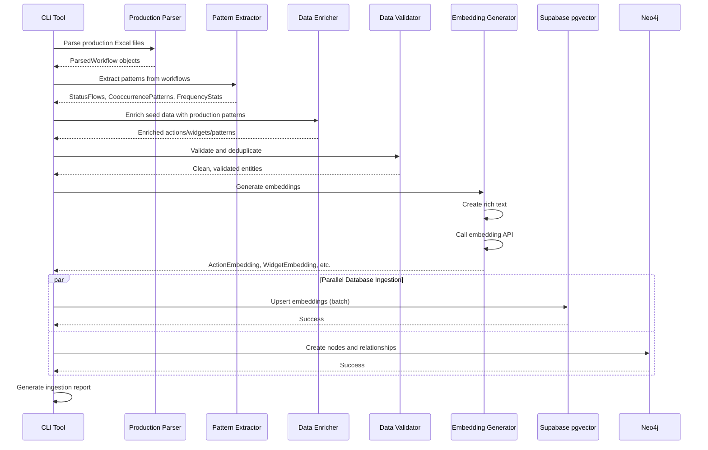

I have created the following plan after thorough exploration and analysis of the codebase. Follow the below plan verbatim. Trust the files and references. Do not re-verify what's written in the plan. Explore only when absolutely necessary. First implement all the proposed file changes and then I'll review all the changes together at the end.

## Observations

The seed data provides a solid foundation with 27 actions, 31 widgets, 8 status patterns, and relationship mappings. However, examining the production Excel files reveals they contain **real-world workflow configurations** from actual FieldPulse customers. These files show how statuses, actions, and widgets are **actually combined in practice**, including co-occurrence patterns, status flow sequences, and role-based configurations that aren't captured in the seed data. The production data will significantly enrich the knowledge base with empirical patterns, making the AI agent's suggestions more accurate and contextually relevant.

## Approach

The strategy is to build a **dual-ingestion pipeline** that combines seed data (canonical definitions) with production data (real-world usage patterns). First, parse production Excel files to extract status flows, action-widget co-occurrences, and frequency counts. Then, create rich text embeddings that combine semantic descriptions with usage context for vector search. Finally, build a Neo4j graph that captures both predefined relationships (from seed) and discovered patterns (from production), weighted by frequency. This hybrid approach ensures the knowledge base has both **definitional accuracy** (seed) and **practical relevance** (production).

---

## Implementation Steps

### 1. Create Production Data Parser Module

**File**: `file:src/clearpath_agent/services/prod_data_parser.py`

Create a parser class that uses `openpyxl` to read the production Excel files and extract structured data:

- Implement `ProductionDataParser` class with methods:
  - `parse_excel_file(filepath: Path) -> ParsedWorkflow`: Main entry point that reads all sheets
  - `_parse_job_custom_status_tab(sheet) -> list[StatusConfig]`: Extract status definitions (name, category, sequence, color)
  - `_parse_action_buttons_tab(sheet) -> list[ActionButtonConfig]`: Extract action buttons with status associations and roles
  - `_parse_focus_view_tab(sheet) -> list[FocusViewConfig]`: Extract widget configurations per status/role
  - `_detect_sheet_structure(sheet) -> SheetType`: Auto-detect which tab type based on headers
  
- Create Pydantic models for parsed data:
  - `ParsedWorkflow`: Container for all data from one Excel file
  - `StatusConfig`: Status with metadata (name, sequence, category, associated actions/widgets)
  - `ActionButtonConfig`: Action button with context (status, role, order, label)
  - `FocusViewConfig`: Widget list with status/role context

- Handle Excel variations:
  - Support different column orderings by matching header names (case-insensitive)
  - Handle missing columns with sensible defaults
  - Skip empty rows and validate data types
  - Log warnings for malformed data without failing entire file

**Dependencies**: `openpyxl`, `pydantic`, `pathlib`, `logging`

---

### 2. Build Pattern Extraction Engine

**File**: `file:src/clearpath_agent/services/pattern_extractor.py`

Create a service that analyzes parsed production data to discover usage patterns:

- Implement `PatternExtractor` class with methods:
  - `extract_status_flows(workflows: list[ParsedWorkflow]) -> list[StatusFlow]`: Identify common status sequences (e.g., "New → On Site → In Progress → Complete")
  - `extract_action_widget_cooccurrence(workflows: list[ParsedWorkflow]) -> list[CooccurrencePattern]`: Find which actions and widgets appear together (e.g., "Take Photo" often paired with "Files/Photos" widget)
  - `extract_role_preferences(workflows: list[ParsedWorkflow]) -> dict[UserRole, ActionPreferences]`: Identify which actions/widgets are preferred by each role
  - `calculate_frequencies(workflows: list[ParsedWorkflow]) -> FrequencyStats`: Count how often each action/widget/status appears across all workflows
  
- Create pattern models:
  - `StatusFlow`: Sequence of statuses with transition counts
  - `CooccurrencePattern`: Pair of action/widget with co-occurrence count and confidence score
  - `ActionPreferences`: Role-specific action/widget usage statistics
  - `FrequencyStats`: Global frequency counts for all entities

- Statistical analysis:
  - Calculate confidence scores using frequency ratios (e.g., if "Take Photo" appears 50 times and "Files/Photos" widget appears with it 45 times, confidence = 0.9)
  - Filter low-confidence patterns (threshold: minimum 3 occurrences, confidence > 0.6)
  - Normalize frequencies across different workflow sizes

**Dependencies**: `collections.Counter`, `dataclasses`, `typing`

---

### 3. Create Embedding Generator Service

**File**: `file:src/clearpath_agent/services/embedding_generator.py`

Build a service that creates rich text representations and generates embeddings:

- Implement `EmbeddingGenerator` class with methods:
  - `generate_action_embedding(action: dict, patterns: FrequencyStats) -> ActionEmbedding`: Create embedding for an action
  - `generate_widget_embedding(widget: dict, patterns: FrequencyStats) -> WidgetEmbedding`: Create embedding for a widget
  - `generate_status_pattern_embedding(pattern: dict, flows: list[StatusFlow]) -> StatusPatternEmbedding`: Create embedding for a status pattern
  - `_create_rich_text(entity: dict, context: dict) -> str`: Generate descriptive text combining definition + usage context
  - `_get_embedding_from_api(text: str) -> list[float]`: Call embedding API (OpenAI or Anthropic)

- Rich text generation strategy:
  - **Actions**: Combine description + common phrases + use cases + "Used in X workflows" + "Often paired with [widgets]"
  - **Widgets**: Combine description + use cases + common phrases + "Appears in X% of workflows" + "Typically shown with [actions]"
  - **Status patterns**: Combine typical status names + typical actions + typical widgets + typical instructions + "Found in X workflows"

- Embedding models:
  - `ActionEmbedding`: Contains action ID, rich text, embedding vector, metadata (frequency, co-occurrences)
  - `WidgetEmbedding`: Contains widget ID, rich text, embedding vector, metadata
  - `StatusPatternEmbedding`: Contains pattern ID, rich text, embedding vector, metadata

- Batch processing:
  - Process embeddings in batches of 100 to optimize API calls
  - Implement retry logic with exponential backoff for API failures
  - Cache embeddings to avoid regenerating for unchanged entities

**Dependencies**: `anthropic` or `openai`, `asyncio`, `tenacity` (for retries)

---

### 4. Implement Supabase Vector Store Ingestion

**File**: `file:src/clearpath_agent/services/vector_store.py`

Create a service to upsert embeddings into Supabase pgvector:

- Implement `VectorStore` class with methods:
  - `initialize_schema()`: Create tables and indexes if they don't exist
  - `upsert_action_embeddings(embeddings: list[ActionEmbedding])`: Insert/update action embeddings
  - `upsert_widget_embeddings(embeddings: list[WidgetEmbedding])`: Insert/update widget embeddings
  - `upsert_status_pattern_embeddings(embeddings: list[StatusPatternEmbedding])`: Insert/update status pattern embeddings
  - `search_similar(query_embedding: list[float], entity_type: str, limit: int) -> list[SearchResult]`: Vector similarity search

- Database schema:
  ```sql
  -- Actions table
  CREATE TABLE actions (
    id TEXT PRIMARY KEY,
    name TEXT NOT NULL,
    description TEXT,
    rich_text TEXT,
    embedding vector(1536),  -- Adjust dimension based on model
    metadata JSONB,
    frequency INT DEFAULT 0,
    created_at TIMESTAMPTZ DEFAULT NOW(),
    updated_at TIMESTAMPTZ DEFAULT NOW()
  );
  CREATE INDEX ON actions USING ivfflat (embedding vector_cosine_ops);
  
  -- Similar tables for widgets and status_patterns
  ```

- Deduplication strategy:
  - Use action/widget/pattern ID as primary key
  - On conflict, update embedding + metadata if rich_text has changed
  - Merge frequency counts (add new occurrences to existing)
  - Keep track of last_updated timestamp

- Batch upsert:
  - Use Supabase batch insert API (max 1000 rows per batch)
  - Implement transaction handling for consistency
  - Log progress (e.g., "Upserted 150/500 actions")

**Dependencies**: `supabase`, `pgvector`, `asyncpg`

---

### 5. Build Neo4j Graph Ingestion Service

**File**: `file:src/clearpath_agent/services/graph_store.py`

Create a service to build the knowledge graph in Neo4j:

- Implement `GraphStore` class with methods:
  - `initialize_schema()`: Create constraints and indexes
  - `create_action_nodes(actions: list[dict])`: Create Action nodes
  - `create_widget_nodes(widgets: list[dict])`: Create Widget nodes
  - `create_status_nodes(statuses: list[dict])`: Create Status nodes
  - `create_relationships(relationships: list[dict], patterns: list[CooccurrencePattern])`: Create edges with weights
  - `merge_production_patterns(patterns: list[CooccurrencePattern])`: Add/update edges from production data

- Neo4j schema:
  ```cypher
  // Node types
  (:Action {id, name, description, frequency})
  (:Widget {id, name, description, frequency})
  (:Status {id, name, category, frequency})
  (:StatusPattern {id, name, description})
  
  // Relationship types
  (Action)-[:SUGGESTS_WIDGET {weight, reason, count}]->(Widget)
  (Action)-[:COMMONLY_PAIRED_WITH {weight, count}]->(Action)
  (Status)-[:HAS_ACTION {role, order, count}]->(Action)
  (Status)-[:HAS_WIDGET {role, order, count}]->(Widget)
  (Status)-[:NEXT_STATUS {count}]->(Status)
  (StatusPattern)-[:TYPICALLY_INCLUDES {weight}]->(Action)
  (StatusPattern)-[:TYPICALLY_INCLUDES {weight}]->(Widget)
  ```

- Constraints and indexes:
  ```cypher
  CREATE CONSTRAINT action_id IF NOT EXISTS FOR (a:Action) REQUIRE a.id IS UNIQUE;
  CREATE INDEX action_name IF NOT EXISTS FOR (a:Action) ON (a.name);
  // Similar for other node types
  ```

- Merge strategy:
  - Use `MERGE` for nodes (create if not exists, update if exists)
  - For relationships: `MERGE` on (source, type, target), then update weight/count
  - Weight calculation: `weight = count / max_count` (normalize to 0-1 range)
  - Combine seed relationships (predefined weights) with production patterns (calculated weights) using weighted average

**Dependencies**: `neo4j`, `typing`

---

### 6. Create Data Enrichment Pipeline

**File**: `file:src/clearpath_agent/services/data_enricher.py`

Build a service that combines seed data with production patterns:

- Implement `DataEnricher` class with methods:
  - `enrich_actions(seed_actions: list[dict], prod_patterns: FrequencyStats) -> list[dict]`: Add frequency counts and co-occurrence data to seed actions
  - `enrich_widgets(seed_widgets: list[dict], prod_patterns: FrequencyStats) -> list[dict]`: Add usage statistics to seed widgets
  - `enrich_status_patterns(seed_patterns: list[dict], prod_flows: list[StatusFlow]) -> list[dict]`: Add real-world flow examples to seed patterns
  - `discover_new_entities(prod_data: list[ParsedWorkflow], seed_data: dict) -> dict`: Find actions/widgets/statuses in production data that aren't in seed data

- Enrichment strategy:
  - **Frequency enrichment**: Add `production_frequency`, `production_workflows` fields
  - **Phrase enrichment**: Merge seed `common_phrases` with phrases extracted from production button labels
  - **Relationship enrichment**: Add `production_cooccurrences` list with top 5 most common pairings
  - **Example enrichment**: Add `real_world_examples` with snippets from production workflows

- New entity handling:
  - Log discovered entities that don't exist in seed data
  - Create basic definitions for new entities using production context
  - Flag them for manual review (add `needs_review: true` field)
  - Generate embeddings using available context

**Dependencies**: `difflib` (for fuzzy matching), `logging`

---

### 7. Implement Deduplication and Validation

**File**: `file:src/clearpath_agent/services/data_validator.py`

Create validation and deduplication logic:

- Implement `DataValidator` class with methods:
  - `deduplicate_actions(actions: list[dict]) -> list[dict]`: Remove duplicate actions using fuzzy matching
  - `deduplicate_widgets(widgets: list[dict]) -> list[dict]`: Remove duplicate widgets
  - `validate_action(action: dict) -> ValidationResult`: Check if action has required fields and valid values
  - `validate_widget(widget: dict) -> ValidationResult`: Validate widget structure
  - `validate_relationship(rel: dict) -> ValidationResult`: Ensure relationship references valid entities
  - `generate_validation_report(results: list[ValidationResult]) -> str`: Create human-readable report

- Deduplication strategy:
  - **Exact match**: Same ID → merge
  - **Fuzzy match**: Similar names (Levenshtein distance < 3) → flag for review
  - **Semantic match**: High embedding similarity (cosine > 0.95) → flag for review
  - Merge strategy: Keep entity with more metadata, combine frequencies

- Validation rules:
  - Actions must have: id, name, description, requires_template, template_type (if required)
  - Widgets must have: id, name, description, category
  - Relationships must reference existing entity IDs
  - Weights must be between 0 and 1
  - Frequencies must be non-negative integers

**Dependencies**: `Levenshtein` or `fuzzywuzzy`, `pydantic`

---

### 8. Build CLI Ingestion Tool

**File**: `file:src/clearpath_agent/cli/ingest.py`

Create a command-line interface for running the ingestion pipeline:

- Implement CLI using `click` or `typer`:
  ```python
  @app.command()
  def ingest(
      seed_dir: Path = "seed/",
      prod_dir: Path = "Clearpath_Prod_Data/",
      skip_vector: bool = False,
      skip_graph: bool = False,
      dry_run: bool = False,
  ):
      """Ingest seed and production data into vector and graph stores."""
  ```

- Pipeline orchestration:
  1. Load seed data from JSON files
  2. Parse all production Excel files
  3. Extract patterns from production data
  4. Enrich seed data with production patterns
  5. Validate and deduplicate all entities
  6. Generate embeddings for all entities
  7. Upsert to Supabase vector store (if not skipped)
  8. Upsert to Neo4j graph store (if not skipped)
  9. Generate ingestion report

- Progress tracking:
  - Use `rich` library for progress bars and status updates
  - Show: "Parsing Excel files... [2/3]", "Generating embeddings... [150/500]"
  - Display summary statistics: "Processed 3 workflows, 45 statuses, 120 actions, 85 widgets"

- Error handling:
  - Continue processing on individual file errors (log and skip)
  - Fail fast on critical errors (database connection, API key invalid)
  - Save partial results before exiting on error
  - Provide rollback option for dry-run mode

- Dry-run mode:
  - Parse and validate all data
  - Generate embeddings (cache locally)
  - Print what would be inserted (counts, sample records)
  - Don't actually write to databases

**Dependencies**: `click` or `typer`, `rich`, `pathlib`

---

### 9. Create Ingestion Configuration

**File**: `file:config/ingestion_config.yaml`

Define configuration for the ingestion process:

```yaml
seed_data:
  actions_file: "seed/actions.json"
  widgets_file: "seed/widgets.json"
  status_patterns_file: "seed/status_patterns.json"
  relationships_file: "seed/relationships.json"

production_data:
  directory: "Clearpath_Prod_Data/"
  file_patterns:
    - "*.xlsx"
    - "*.xls"
  skip_files:
    - "~$*.xlsx"  # Temp Excel files

embedding:
  model: "text-embedding-3-small"  # or "voyage-2"
  dimension: 1536
  batch_size: 100
  max_retries: 3

vector_store:
  table_prefix: "clearpath_"
  batch_size: 1000
  create_indexes: true

graph_store:
  batch_size: 500
  merge_strategy: "weighted_average"  # or "production_only", "seed_only"
  min_relationship_weight: 0.3

validation:
  fuzzy_match_threshold: 0.85
  semantic_match_threshold: 0.95
  min_frequency: 1
  require_manual_review: true

logging:
  level: "INFO"
  file: "logs/ingestion.log"
  format: "%(asctime)s - %(name)s - %(levelname)s - %(message)s"
```

Load this config in the CLI tool using `pyyaml` or `pydantic-settings`.

---

### 10. Add Comprehensive Error Handling and Logging

**File**: `file:src/clearpath_agent/utils/logging_config.py`

Set up structured logging:

- Configure logging with:
  - File handler: Write to `logs/ingestion.log`
  - Console handler: Pretty-print to terminal with colors
  - JSON handler: Structured logs for monitoring (optional)

- Log levels:
  - **DEBUG**: Detailed parsing info, API requests
  - **INFO**: Progress updates, summary statistics
  - **WARNING**: Skipped files, fuzzy matches, missing fields
  - **ERROR**: Failed API calls, database errors
  - **CRITICAL**: Fatal errors that stop ingestion

- Structured log format:
  ```json
  {
    "timestamp": "2024-01-15T10:30:00Z",
    "level": "INFO",
    "component": "ProductionDataParser",
    "message": "Parsed Excel file",
    "metadata": {
      "file": "HCP_workflow.xlsx",
      "statuses": 8,
      "actions": 45,
      "widgets": 12
    }
  }
  ```

**Dependencies**: `logging`, `rich.logging`, `python-json-logger` (optional)

---

### 11. Create Ingestion Report Generator

**File**: `file:src/clearpath_agent/services/report_generator.py`

Build a service that generates human-readable ingestion reports:

- Implement `ReportGenerator` class with methods:
  - `generate_summary_report(stats: IngestionStats) -> str`: Overall statistics
  - `generate_validation_report(results: list[ValidationResult]) -> str`: Validation issues
  - `generate_enrichment_report(enriched: dict, original: dict) -> str`: What was added/changed
  - `generate_pattern_report(patterns: list[CooccurrencePattern]) -> str`: Discovered patterns

- Report sections:
  1. **Summary**: Total entities processed, time taken, success rate
  2. **Seed Data**: Counts from seed files
  3. **Production Data**: Files processed, workflows extracted
  4. **Enrichment**: New phrases added, frequency updates, new relationships
  5. **Patterns Discovered**: Top co-occurrences, common flows
  6. **Validation Issues**: Duplicates found, missing fields, manual review needed
  7. **Database Operations**: Records inserted/updated in vector store and graph store

- Output formats:
  - **Console**: Formatted text with tables (using `rich.table`)
  - **Markdown**: Save to `reports/ingestion_YYYYMMDD_HHMMSS.md`
  - **JSON**: Save to `reports/ingestion_YYYYMMDD_HHMMSS.json` for programmatic access

**Dependencies**: `rich.table`, `json`, `datetime`

---

### 12. Add Unit Tests for Ingestion Pipeline

**File**: `file:tests/test_ingestion.py`

Create comprehensive tests:

- Test `ProductionDataParser`:
  - Parse valid Excel file → returns correct ParsedWorkflow
  - Parse Excel with missing columns → uses defaults
  - Parse Excel with invalid data → logs warnings, skips bad rows
  - Parse non-Excel file → raises appropriate error

- Test `PatternExtractor`:
  - Extract status flows from multiple workflows → identifies common sequences
  - Extract co-occurrences → calculates correct frequencies and confidence scores
  - Handle single workflow → doesn't crash, returns valid patterns

- Test `EmbeddingGenerator`:
  - Generate rich text for action → includes description + phrases + context
  - Generate embeddings → returns correct dimension vector
  - Handle API failures → retries and eventually fails gracefully

- Test `DataEnricher`:
  - Enrich actions with production data → adds frequency and co-occurrences
  - Discover new entities → identifies entities not in seed data
  - Merge duplicate phrases → deduplicates correctly

- Test `DataValidator`:
  - Validate valid action → passes
  - Validate action with missing required field → fails with clear message
  - Deduplicate exact matches → merges correctly
  - Deduplicate fuzzy matches → flags for review

- Use fixtures:
  - `sample_excel_file`: Mock Excel file with known data
  - `sample_seed_data`: Small subset of seed JSON
  - `sample_parsed_workflow`: Pre-parsed workflow for testing downstream components

**Dependencies**: `pytest`, `pytest-mock`, `openpyxl` (for creating test Excel files)

---

## Mermaid Diagram: Ingestion Pipeline Flow



---

## Key Design Decisions

| Decision | Rationale |
|----------|-----------|
| **Dual ingestion (seed + production)** | Seed provides canonical definitions; production provides real-world usage patterns. Combining both gives best of both worlds. |
| **Rich text for embeddings** | Embedding just the description loses context. Rich text includes use cases, common phrases, and co-occurrence info for better semantic search. |
| **Neo4j for graph** | Relationships between actions/widgets/statuses are complex and multi-hop. Neo4j excels at graph traversal queries like "find all widgets commonly paired with actions that suggest this widget". |
| **Weighted relationships** | Production data shows frequency of co-occurrence. Weights (normalized counts) allow ranking suggestions by confidence. |
| **Batch processing** | API calls and database operations are expensive. Batching reduces latency and cost. |
| **Deduplication with fuzzy matching** | Production data may have slight variations in naming (e.g., "Clock In/Out" vs "Clock in / out"). Fuzzy matching catches these. |
| **CLI with dry-run** | Allows testing the pipeline without modifying databases. Critical for debugging and validation. |

---

## Expected Outputs

After running the ingestion pipeline, you will have:

1. **Supabase pgvector tables** populated with:
   - ~27+ actions with embeddings
   - ~31+ widgets with embeddings
   - ~8+ status patterns with embeddings
   - All enriched with production frequency and co-occurrence data

2. **Neo4j graph database** with:
   - Action, Widget, Status, StatusPattern nodes
   - SUGGESTS_WIDGET, COMMONLY_PAIRED_WITH, HAS_ACTION, HAS_WIDGET, NEXT_STATUS relationships
   - Weights based on production data frequency

3. **Ingestion report** showing:
   - Total entities processed
   - Patterns discovered (e.g., "Take Photo + Files/Photos widget: 92% co-occurrence")
   - Validation issues (duplicates, missing fields)
   - Database operation summary

4. **Logs** in `logs/ingestion.log` for debugging and auditing