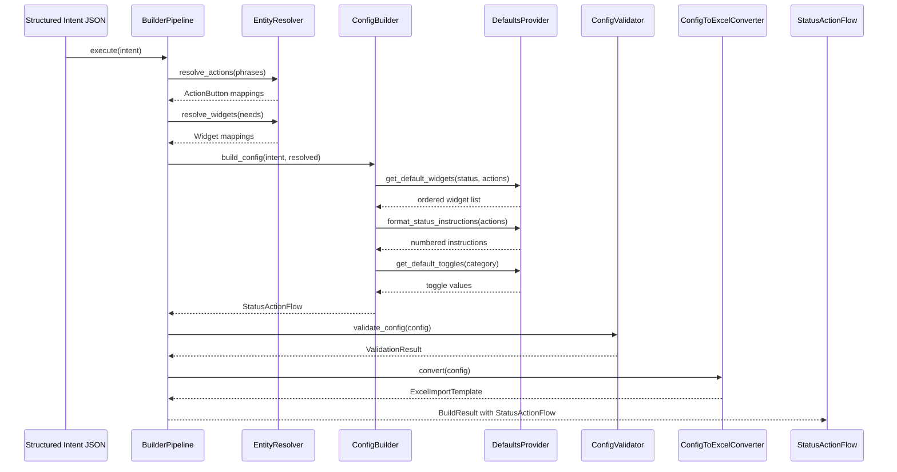

I have created the following plan after thorough exploration and analysis of the codebase. Follow the below plan verbatim. Trust the files and references. Do not re-verify what's written in the plan. Explore only when absolutely necessary. First implement all the proposed file changes and then I'll review all the changes together at the end.

## Observations

The codebase has well-defined Pydantic models (`entities.py`, `excel_schemas.py`) that define the input (Structured Intent JSON) and output (StatusActionFlow) schemas for Phase 3. The ConfigBuilder receives structured intent from the LLM extraction phase and outputs a complete StatusActionFlow that the Excel Generator will consume. The ClearPath Tier 1 documentation provides clear best practices: numerical status instructions, action buttons positioned at bottom, and default widget ordering (Job Title → Job Status → Status Instructions → Action Buttons). Existing validation services and pattern extraction provide the knowledge needed for intelligent defaults.

## Approach

The ConfigBuilder is a deterministic assembly engine that transforms Structured Intent JSON into StatusActionFlow objects. It takes the LLM's extracted workflow steps, action phrases, and information needs, then applies canonical entity resolution, production-proven defaults, and validation rules to produce a complete, ready-to-export configuration. The builder maintains clear separation between input schema (Structured Intent), processing logic (resolution, defaults, validation), and output schema (StatusActionFlow).

## Implementation Steps

### 1. Create Input Schema for Structured Intent

**File**: `file:src/clearpath_agent/models/intent_schemas.py`

Define Pydantic models for the structured intent JSON that comes from the LLM extraction step:

- `ExtractedPhrase`: Model for action/widget phrases with confidence scores
- `ExtractedStep`: Model for workflow steps with actions and information needs
- `StructuredIntent`: Top-level model containing workflow name, steps, and metadata
- Add validation for confidence thresholds (>0.85 auto-accept, 0.6-0.85 flag, <0.6 reject)
- Include fields for ambiguity flags and low-confidence matches requiring review
- Ensure schema matches the output format from LLM Semantic Extraction phase

### 2. Create Configuration Defaults Service

**File**: `file:src/clearpath_agent/services/config_defaults.py`

Build a service that provides intelligent defaults based on best practices and production patterns:

- `DefaultsProvider` class with methods for:
  - `get_default_widgets(status_name, actions)`: Returns ordered widget list following Tier 1 best practice (Job Title → Job Status → Status Instructions → context-specific widgets → Action Buttons at bottom)
  - `get_default_toggles(status_category)`: Returns default values for display_action_menu, ability_to_change_status, focus_view_enabled, restrict_to_focus_view based on status category
  - `format_status_instructions(actions)`: Converts action list to numbered instructions (1., 2., 3., etc.) per Tier 1 doc
  - `suggest_related_widgets(actions)`: Uses production co-occurrence data from knowledge base to suggest widgets that commonly appear with given actions
  - `get_role_defaults()`: Returns default role assignments (Service Agent for field statuses, Admin for office statuses)
- Load production patterns from knowledge base (FrequencyStats, CooccurrencePattern) to inform defaults
- Cache frequently accessed patterns for performance

### 3. Create Action/Widget Resolver Service

**File**: `file:src/clearpath_agent/services/entity_resolver.py`

Build a service that maps extracted phrases to canonical action/widget types:

- `EntityResolver` class with methods:
  - `resolve_action(phrase, confidence)`: Maps phrase to `ActionButtonType` enum value using knowledge base vector search
  - `resolve_widget(phrase, confidence)`: Maps phrase to `WidgetType` enum value using knowledge base vector search
  - `handle_low_confidence(phrase, candidates)`: Returns multiple candidates for user review when confidence < 0.85
  - `check_template_requirements(action_type)`: Validates if action requires template_id or form_id
- Use vector similarity search against knowledge base embeddings for phrase matching
- Return confidence scores and alternative matches for ambiguous cases
- Leverage existing `VectorStore` service for lookups

### 4. Implement ConfigBuilder Core Class

**File**: `file:src/clearpath_agent/services/config_builder.py`

Create the main configuration builder that orchestrates the assembly process:

- `ConfigBuilder` class with primary method `build_config(intent: StructuredIntent) -> StatusActionFlow`:
  - Parse structured intent and extract workflow metadata
  - For each step in intent:
    - Resolve action phrases to `ActionButton` objects using `EntityResolver`
    - Resolve information needs to `Widget` objects
    - Apply default widgets using `DefaultsProvider`
    - Format status instructions with numerical ordering
    - Apply default toggles based on status category
    - Create `Status` object with all components
  - Link statuses with next_status/previous_status relationships based on sequence
  - Create complete `StatusActionFlow` object
  - Return assembled configuration ready for Excel generation

- Helper methods:
  - `_create_action_button(phrase, label, order, resolved_type)`: Creates ActionButton with proper validation
  - `_order_widgets(widgets)`: Ensures proper widget ordering (Job Title first, Action Buttons last)
  - `_apply_best_practices(status)`: Enforces Tier 1 doc recommendations
  - `_handle_ambiguities(low_confidence_items)`: Flags items needing user review

### 5. Add Validation Layer

**File**: `file:src/clearpath_agent/services/config_validator.py`

Create a specialized validator for complete configurations (extends `DataValidator`):

- `ConfigValidator` class with methods:
  - `validate_config(config: StatusActionFlow) -> ValidationResult`: Validates complete configuration
  - `validate_action_button_limits(status)`: Ensures max 10 action buttons per status (ClearPath hard limit)
  - `validate_template_requirements(action_buttons)`: Checks that actions requiring templates have template_id/form_id
  - `validate_widget_compatibility(widgets)`: Ensures widget combinations make sense
  - `validate_status_flow_logic(statuses)`: Checks that next_status/previous_status links are valid
  - `validate_role_assignments(statuses)`: Ensures each status has appropriate role
  - `check_best_practices(config)`: Warns if configuration deviates from Tier 1 best practices (non-blocking)

- Return structured validation results with:
  - Errors (blocking issues that prevent Excel generation)
  - Warnings (best practice violations, user should review)
  - Suggestions (optional improvements based on production patterns)

### 6. Create Configuration to Excel Schema Converter

**File**: `file:src/clearpath_agent/services/config_to_excel.py`

Build a converter that transforms `StatusActionFlow` to `ExcelImportTemplate` (consumed by Phase 4):

- `ConfigToExcelConverter` class with method `convert(config: StatusActionFlow) -> ExcelImportTemplate`:
  - Generate `JobCustomStatusRow` for each status in Tab 1
  - Generate `ActionButtonRow` for each action button per status per role in Tab 2
  - Generate `FocusViewRow` for each status per role in Tab 3
  - Handle multi-role expansion (if status applies to multiple roles, create separate rows)
  - Apply proper sequencing and ordering

- Helper methods:
  - `_expand_roles(status)`: Creates role-specific configurations
  - `_format_widgets_for_excel(widgets)`: Converts Widget objects to WidgetType list
  - `_validate_excel_schema(template)`: Ensures output matches Excel schema requirements

### 7. Add Default Templates and Patterns

**File**: `file:src/clearpath_agent/data/default_templates.py`

Create reusable configuration templates for common workflow types:

- Define template dictionaries for common patterns extracted from production data:
  - `SERVICE_CALL_TEMPLATE`: Standard service call workflow (Scheduled → On Site → In Progress → Complete)
  - `INSTALLATION_TEMPLATE`: Installation workflow with pre-work, installation, testing phases
  - `INSPECTION_TEMPLATE`: Inspection workflow with arrival, inspection, reporting
  - `EMERGENCY_TEMPLATE`: Emergency service workflow with rapid response steps

- Each template includes:
  - Default status names and sequences
  - Common action buttons for each status
  - Recommended widgets
  - Status instructions templates
  - Toggle defaults

- `TemplateSelector` class to match user intent to closest template as starting point (optional enhancement)

### 8. Implement Builder Pipeline Orchestrator

**File**: `file:src/clearpath_agent/services/builder_pipeline.py`

Create an orchestrator that chains all builder components:

- `BuilderPipeline` class with method `execute(intent: StructuredIntent) -> BuildResult`:
  - Initialize all services (resolver, defaults provider, validator, converter)
  - Execute build steps in sequence:
    1. Validate input intent schema
    2. Resolve all phrases to canonical entities using EntityResolver
    3. Build configuration using ConfigBuilder
    4. Validate configuration using ConfigValidator
    5. Convert to Excel schema using ConfigToExcelConverter
    6. Final validation of Excel schema
  - Collect all warnings, errors, and suggestions
  - Return `BuildResult` with configuration, Excel template, and validation results

- `BuildResult` dataclass:
  - `config: StatusActionFlow`: The built configuration
  - `excel_template: ExcelImportTemplate`: Ready for Phase 4 (Excel generation)
  - `validation_results: list[ValidationResult]`: All validation issues
  - `low_confidence_items: list[dict]`: Items flagged for user review
  - `applied_defaults: list[str]`: Log of defaults that were applied
  - `success: bool`: Whether build completed without errors

### 9. Add Configuration Review and Edit Support

**File**: `file:src/clearpath_agent/services/config_editor.py`

Create utilities for users to review and modify generated configurations before Excel export:

- `ConfigEditor` class with methods:
  - `get_editable_json(config)`: Converts StatusActionFlow to user-friendly JSON format
  - `apply_user_edits(config, edits)`: Merges user modifications back into configuration
  - `validate_edits(edits)`: Ensures user edits don't break validation rules
  - `get_review_summary(config)`: Generates human-readable summary of configuration
  - `highlight_low_confidence(config, low_confidence_items)`: Marks items needing attention

- Support for partial edits (user can modify specific statuses/actions without rebuilding entire config)

### 10. Create Comprehensive Unit Tests

**File**: `file:tests/test_config_builder.py`

Test all ConfigBuilder components:

- Test intent parsing and validation
- Test action/widget resolution with various confidence levels
- Test default application (widgets, toggles, instructions)
- Test validation rules (max 10 buttons, template requirements, etc.)
- Test Excel schema conversion
- Test multi-role expansion
- Test best practices enforcement
- Test error handling for invalid inputs

**File**: `file:tests/test_builder_pipeline.py`

Test end-to-end pipeline:

- Test complete workflow from Structured Intent JSON → StatusActionFlow → ExcelImportTemplate
- Test with real-world examples from production data
- Test ambiguity handling and low-confidence scenarios
- Test validation error propagation
- Test user edit application

### 11. Add Integration with Existing Services

**File**: `file:src/clearpath_agent/services/config_builder.py` (update)

Integrate ConfigBuilder with existing knowledge base services:

- Use `VectorStore` for phrase → canonical entity lookups in EntityResolver
- Use `GraphStore` to traverse relationships for widget/action suggestions in DefaultsProvider
- Use `PatternExtractor` results to inform defaults (frequency stats, co-occurrence patterns)
- Use `DataEnricher` production patterns for frequency-based prioritization
- Cache frequently used patterns to improve performance

### 12. Create CLI Command for Testing

**File**: `file:src/clearpath_agent/cli/build.py`

Add CLI command for testing the builder:

- `clearpath-agent build` command with options:
  - `--intent-file`: Path to JSON file with Structured Intent JSON
  - `--output`: Path for generated StatusActionFlow JSON
  - `--review`: Show configuration for review before export
  - `--validate-only`: Run validation without generating output

- Display build results, validation issues, and low-confidence items
- Allow interactive review and editing before final export

### 13. Add Logging and Debugging Support

**File**: `file:src/clearpath_agent/services/config_builder.py` (update)

Enhance all builder services with comprehensive logging:

- Log each step of the build process (resolution, default application, validation)
- Log applied defaults and why they were chosen
- Log validation warnings and errors with context
- Create debug mode that outputs intermediate states
- Add performance metrics (time per step, cache hit rates)

### 14. Create Documentation and Examples

**File**: `file:docs/config_builder_guide.md`

Document the ConfigBuilder usage:

- Overview of the build process
- Input format (Structured Intent JSON schema)
- Output format (StatusActionFlow)
- Default behaviors and how to override them
- Validation rules and how to fix common errors
- Best practices for creating configurations
- Examples of complete intent → config flows

**File**: `file:examples/sample_intents/`

Create example intent JSON files:

- `service_call_intent.json`: Simple service call workflow
- `installation_intent.json`: Complex installation with multiple phases
- `inspection_intent.json`: Inspection workflow with forms and photos
- `low_confidence_intent.json`: Example with ambiguous phrases for testing

---

## Architecture Diagram

## Validation Rules Summary

| Rule | Severity | Description |
|------|----------|-------------|
| Max 10 action buttons per status | ERROR | Blocks Excel generation |
| Template requirements | ERROR | Actions like "Fill Form" need form_id |
| Unique status names | ERROR | No duplicate status names in workflow |
| Valid status sequences | ERROR | Sequences must be 1, 2, 3... with no gaps |
| Widget compatibility | WARNING | Some widgets don't make sense together |
| Best practice: Action buttons at bottom | WARNING | Should follow Tier 1 doc recommendation |
| Best practice: Numerical instructions | WARNING | Instructions should be numbered |
| Low confidence matches | INFO | Flagged for user review |

## Default Widget Ordering

Following Tier 1 doc best practices, widgets are ordered as:

1. **Job Title** (always first)
2. **Job Status** (always second)
3. **Status Instructions** (always third)
4. **Context-specific widgets** (based on actions):
   - Customer Contact (if communication actions present)
   - Forms (if Fill Form action present)
   - Files/Photos (if Take Photo action present)
   - Timesheets (if Clock In/Out action present)
   - Estimates/Invoices (if financial actions present)
5. **Action Buttons** (always last for thumb accessibility)
